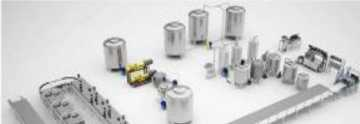
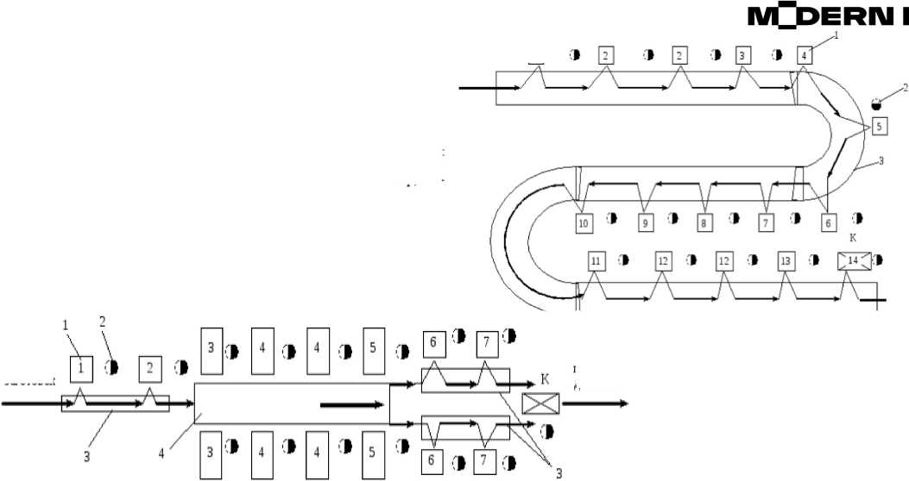
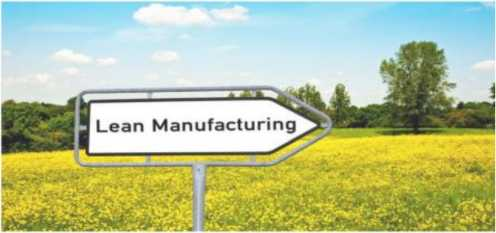
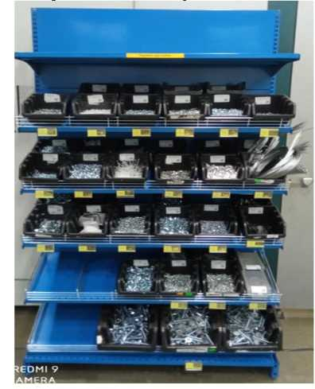
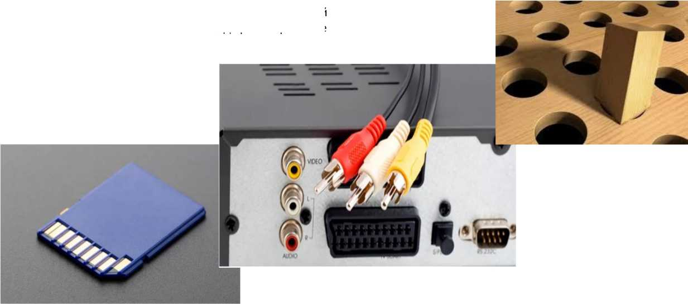
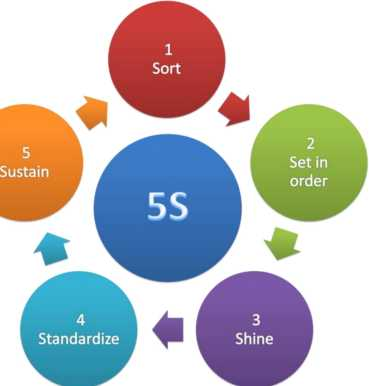
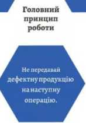
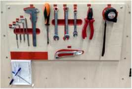

Зміст:

* потокове виробництво.
    
* ощадливе виробництво.
    
* інструменти ощадливого виробництва.
    

Потокове виробництво - це форма організації виробничого процесу, заснована на ритмічному повторенні погоджених в часі основних і допоміжних операцій основного виробничого процесу, які виконуються на спеціалізованих робочих місцях, розташованих послідовно за ходом технологічного процесу.

Потокове виробництво — це найбільш ефективна форма організації виробництва по масовому випуску продукції, що забезпечує високе зростання продуктивності праці, безперервність виробничого процесу і найвищий рівень якості.

Потокова лінія - група робочих місць, за якими закріплене виготовлення одного чи обмеженої кількості найменувань виробів і виробничий процес на яких здійснюється відповідно до ознак потокового виробництва. Декілька потокових ліній

  

складають цех.

  

  

Основні напрями поліпшення роботи ПОТОКОВИХ ліній

*   □ Зниження простоїв обладнання;
    
*   □ Своєчасне подавання сировини і матеріалів;
    
*   □ Раціоналізація робочих місць потоку;
    
*   □ Поліпшення умов праці на робочих місцях;
    
*   □ Синхронізація роботи потоку;
    
*   □ Введення багатоверстатного обслуговування і суміщення професій.
    
    Рис. 11.2. Г- і П-подіоні потокові лінії:
    
    Подача заготовок
    
    Подана J ПП заготовок       і—і
    
    
    
    Вшід готсвш деталей
    
    Вшід готовий деталей
    
      
    
    1 — устаткування; 2 — оператор; 3 — рольганг; і (S3 — контролер
    
      
    

Рис. 11.4. Комбінована потокова лінія:

1 — устаткування; 2 — оператор; 3 — рольганг; 4 — конвеєр

Прямолінійне розташування робочих місць за ходом технологічного процесу вважається найпростішим плануванням. Але це можливо за невеликої кількості робочих місць на лінії. В інших випадках використовують дворядне, зигзагоподібне, кільцеве та інші види розташування робочих місць.

Ознаки потокового виробництва:

* розташування робочих місць відповідно до процесу і часу;
    
* ритмічне виконання виробничих операцій;
    
* узгодженість і одночасність виконання різних операцій;
    
* вузька спеціалізація робочих місць за операціями;
    
* високий ступінь безперервності виробничого процесу;
    
* паралельність здійснення операцій технологічного процесу.
    

Переваги потокового виробництва:

* підвищення продуктивності праці;
    
* скорочення тривалості виробничого циклу;
    
* зменшення заділів незавершеного виробництва;
    
* прискорення оборотності оборотних коштів;
    
* підвищення якості виробів, зниження дефектності;
    
* зниження собівартості виробів.
    
    
    
      
    

Ощадливе виробництво

Ощадливе виробництво (Lean production)— концепція менеджменту була створена на японському підприємстві TOYOTA і заснована на неухильному прагненні до усунення всіх видів втрат. Ощадливе виробництво передбачає залучення у процес оптимізації бізнесу кожного співробітника і максимальну орієнтацію на споживача.

Мета концепції ощадливого виробництва позбутися всіх видів втрат і домогтися максимальної ефективності використання ресурсів шляхом поступального й безперервного вдосконалення всіх бізнес-процесів організації, спрямованих на підвищення задоволеності споживачів.

  

Цілями ощадного виробництва є:

*   1\. Скорочення трудовитрат.
    
*   2\. Скорочення термінів розробки нової продукції.
    
*   3\. Скорочення термінів створення продукції.
    
*   4\. Скорочення виробничих і складських площ.
    
*   5\. Гарантія постачання продукції замовнику.
    
*   6\. Максимальна якість при мінімальній вартості.
    
    
    
      
    
    Привабливість LEAN в тому, що система на 80% складається з організаційних заходів, і тільки 20% складають інвестиції в технологію.
    
      
    
    Необхідно зазначити, шо на сьогоднішній день ощадливе виробіпщтво застосовують майже 100% Японських компаній. 72% компаній США, у Великобританії - 56%, в Бразилії -55%, в Мексиці - 42%, в той час як на Україні ощадливим виробництвом займаються тільки одиниці компаній. Для підприємств України такий крок переходу на ощадливе виробництво був би логічним у зв’язку із вступом її у ВТО. і значним підвищенням вартості енергоресурсів.
    
      
    
    
    
      
    
    про
    
      
    
    На сьогодні концепція, яка традиційно застосовувалася у виробничих організаціях, успішно адаптована також до специфіки сфери послуг, місцевого самоврядування, державного управління. Все частіше говорять не про ощадливе виробництво, а про ощадливе управління.
    
    За даними інституту ощадливого виробництва, впровадження цих підходів дозволяє скоротити в середньому: тривалість виробничого циклу на 50%, обсяги незавершеного виробництва — на 60%, кількість випадків переробки продукції - на 70%, необхідні площі — на 30%=, необхідний для переналадки обладнання час - на 65%.
    
      
    
    Перевиробництво
    
      
    
    Дефекти та переробка браку
    
      
    
    Зайві рухи
    
      
    
    Транспортування
    
      
    
    Надмірні запаси
    
      
    
    Надлишкова обробка
    
      
    
    Очікування
    
      
    
    Невикористання потенціалу працівників
    
      
    
    
    
      
    
    
    
      
    
    Перевиробництво - це процес виготовлення більшої кількості продукції (ніж потрібно) та раніше ніж це потрібно. Перевиробництво є найвагомішою втратою і часто спричиняє решту видів втрат.
    
      
    
    Види втрат
    
      
    
    
    
    Перевиробництво
    
      
    
    Дефекти та переробка браку - це створення дефектної продукції, яку потрібно переробити, відремонтувати чи утилізувати. Також сюди включають витрати на сортування, ремонт та/або заміну продукту. Переробку частини продукції та кож вважають втратою.
    
      
    
    Види втрат
    
      
    
    
    
    Дефекти та переробка браку
    
      
    
    Зайві рухи - це будь-які переміщення працівників, які не є необхідними для додавання цінності виробу чи сервісу. Сюди включають пошук інструментів, матеріалів чи інформації, ходіння між робочими місцями для отримання чи здачі матеріалів.
    
      
    
    Види втрат
    
      
    
    
    
    Зайві рухи
    
      
    

Транспортування - це будь-яке переміщення матеріалів, яке не є необхідним в процесі обробки.

Наприклад, переміщення продукції в інші приміщення для наступного кроку процесу або переміщення інформації в інший тип файлу чи систему для додаткової обробки.

Види втрат

  

Транспортування

  

Види втрат

  

Надмірні запаси - це будь-які закупки (матеріалів чи виробів), що перевищують актуальну потребу чи не відповідає Just-In-Time принципу.

Надмірні запаси

  

Надмірна обробка - це будь-які кроки, що не додають жодної цінності продукції з точки зору споживача. Наприклад, надмірна кількість погоджень, додаткові інспекції та перевірки або процеси поза специфікацією.

Види втрат

0

Надлишкова обробка

  

Види втрат

  

Очікування - коли працівник очікує обладнання, іншого працівника, запасні частини, інструкції, затвердження, інформацію, обслуговування, прийняття рішення.

Нехтування талантами працівників - коли персонал розцінюється, як машина для виконання роботи, а не як фахівець та експерт у своїй роботі. Працівнику говорять, що він має робити та ніхто ніколи не питає, що він думає і його не залучають для пошуку рішення чи можливостей оптимізації процесів.

  

  

Інструменти ощадливого виробництва
----------------------------------

*   1\. Система TPM (Total Productive Maintenance) — Загальний догляд за обладнанням.
    

Концепція управління виробничим обладнанням, націлена на підвищення ефективності технічного обслуговування.

У буквальному перекладі ТРМ означає «загальне технічне обслуговування». При цьому визначення "загальне" відноситься не тільки до продуктивного і економічно технічного обслуговування, а й до всієї системи ефективного догляду за обладнанням протягом його терміну служби, а також до включення в цей процес кожного окремого співробітника і різних відділів через залучення до технічного обслуговування операторів , які безпосередньо працюють на обладнанні.

*   2\. Швидке переналагодження SMED (Single-Minute Exchange of Dies) (швидка заміна штампів, букв. «Швидка зміна прес-форм»). По суті, система SMED - це набір теоретичних і практичних методів, які дозволяють скоротити час операцій налагодження і переналагодження обладнання. Спочатку ця система була розроблена для того, щоб оптимізувати операції заміни штампів і переналагодження відповідного обладнання, проте принципи «швидкого переналагодження» можна застосовувати до всіх типів процесів.
    
*   3\. Кайдзен (kaizen) — (японський термін «безперервне вдосконалення», «поліпшення» або «зміна на краще») — японська філософія або практика, яка фокусується на безперервному вдосконаленні процесів виробництва, розробки, допоміжних бізнес-процесів і управління, а також всіх аспектів життя організації.
    
*   4\. Гемба кайдзен — безперервне вдосконалення на місці створення доданої вартості.
    

Інструменти ощадливого виробництва
----------------------------------

*   5\. Якраз вчасно — система синхронізації передачі продукту з однієї виробничої стадії на іншу за допомогою карток канбан. Комплектуючі повинні передаватися на наступну стадію тільки тоді, коли це потрібно, і ні на хвилину раніше.
    
*   6\. Системи витягування, канбан— продукція «витягується» з боку замовника, а не «штовхається» виробником. Інформування попередньої виробничої стадії про те, що потрібно починати роботу.
    
    
    
      
    

Інструменти ощадливого виробництва
----------------------------------

*   7\. «Рока-уоке» («захист від помилок», «захист від дурня») — метод запобігання помилок — спеціальний пристрій або метод, завдяки якому дефекти просто не можуть з'явитися.
    
    
    
      
    

Інструменти ощадливого виробництва
----------------------------------

*   8\. Система 5S (сортування, впорядкування(підтримання порядку), раціональне розміщення, стандартизуйте, вдосконалюйте).
    
    прибиральниці), так і виробниче приміщення в цілому.
    
      
    
    
    
      
    

Це, напевне, найпопулярніший метод ощадливого виробництва. Його суть полягає в раціональній та ефективній організації робочого простору. У цій системі робочий простір розглядається як індивідуальне робоче місце окремого співробітника (від директора до Для покращення роботи компанії та підвищення швидкості впровадження методології ощадливого виробництва необхідно керуватися принципом роботи — правилом трьох «НЕ».

  

  

Інструменти ощадливого виробництва
----------------------------------

  

Сортування - необхідно розділити всі предмети в робочому просторі на групи: - завжди потрібні - знаходяться в робочому просторі, - іноді потрібні - винесені з робочого простору, але залишаються в межах досяжності, - непотрібні - повинні бути видалені.

Основна ідея цього принципу - чим менше речей нас оточує тим легше працювати.

Раціональне розміщення,Впорядкування (підтримання порядку)-для кожної речі і інструменту має бути визначено своє конкретне місце, вибір місця для кожного інструменту повинен проводитись раціонально

Прибирання (підтримання порядку)- Робочий простір знаходиться в чистоті та порядку, внаслідок регулярного прибирання від бруду обладнання та прилеглоїтериторії.

Стандартизація - цей метод має на увазі створення наочних інструкцій для співробітників, що описують основні процеси виробництва. Інструкції повинні регламентувати всі операції, які виконує співробітник, максимально коротко, зрозуміло і наочно.

Вдосконалення - для існування системи 5S необхідно не тільки підтримувати вже розроблені механізми, а й постійно їх удосконалювати.

3) Втрати при переміщенні

  

  

Втрати при переміщенні - цс непотрібні переміщення персоналу', продукції, матеріалів та обладнання, які не додають цінності продукту; Часто робітники виконують зайві переміщення зі своєї дільниці до цехового складу і в зворотньому' напрямку, а також ходять навкруги непотрібного їм

  

прискорити процес. Це одна з найбільш неприємних втрат, тому що витрачений час і простої роблять неефективними більшість виробничих процесів, обтяжуючи працю робітників.

  

Що треба робити для усунення втрат:

*   \> Визна’іити. коли персонал здійснює непотрібні переміщення и скласти комплексну схему (діаграму «спагеті») фактичних потоків процесу.
    
*   \> Скоротити втрати методом розробки та вивчення карти потоку створення цінності та/або карти фізичних потоків для кожного процесу з наступним скороченням переміщень операторів, обладнання, матеріалів.
    

  

  

  

*   7) Втрати часу на очікування
    

Втрати часу на очікування виникають, коли люди, операції або частково готова продукція вимушені очікувати наступних дій, інформації або матеріалів. Погане планування, необов’язковість постачальників, проблеми комунікацій та недосконале управління запасами приводять до простоїв, які коштують грошей та часу.

  

Що треба робити для усунення втрат:

*   ❖ Знайти людей або обладнання. які очікують завершення попередньої або початку наступної операції, поступлення матеріалів або інформації.
    
*   ❖ Скоротити втрати через вирівнювання загрузки виробничих ліній. Для цього доцільно використати стовпчикову діаграму час циклу/час такту для синхронізації процесів.
    

Отже, кожне підприємство самостійно вирішує, який вибрати

  

ними боротися необхідно, д.ія виживання на ринку факт

  

\*       6) Втрати від надлишкової обробки

продукції або послуг з більш високою споживчою якісно, ніж це вимагає покупець і за яку він згоден платити. Недостатня інформація про тс, як споживачі використовують продукцію або послуги, часто сприяє додаванню до них надлишкових функціональних можливостей, в яких, за думкою виробника, замовники мають потребу, або бажають їх (однак точно це невідомо).

Що треба робити для усунення втрат-:

*   □ Визначити продукти, які повернені покупцями як зіпсовані або які мають дсфекіи тих місцях, де до поломки не було слідів зносу. Уточнити , ситуацію через опитування споживачів та дослідження роботи продукту в реальних умовах.
    
*   □ Скоротити втрати за рахунок визначення того, які функціональні можливості реально потрібні споживачу і за що він готовий платити. Для цього необхідно добре розуміти і чітко уявляти, як саме і в яких умовах замовники використовують конкретний продукт.
    

  

*   4) Втрати при транспортуванні
    

або інформація переміщуються частіше або на більші відстані, ніж це дійсно необхідно. Замість того щоб розташувати процеси послідовно або поряд, їх часто розташовують далеко один від одного, що вимагає використання автопогрузчики», конвеєрів або інших транспортних засобів для переміщення матеріалів на наступну' операцію.

Що треба зробиш для усунення втрат:

*   Визначити переміщення персонал}', матеріалів або інформації, які не сприяють процесу створення цінності.
    
*   Скоротити втрати за рахунок мінімізації фізичної відстані транспортування матеріалів і переміщення транспортних засобів, зробити перепланування розміщення обладнання, виділити відповідні виробничі зони.
    

  

5) Втрати від надлишкових запасів

Втрати, які криються в надлишкових запасах, містять багато і неприємних проблем якості, таких як переробка і дефекти, проблеми в . плануванні робочої сили та/або виробництва, завищений час виконання замовлень, проблеми з постачальниками. Підтримувати надлишкові запаси, які заморозили обертові кошти і потребують виплат банківських процентів, ; дуже дорого. Надлишкові запаси знижують віддачу від вкладень в робочі силу і сировину.

Що треба робити для усунення втрат:

Визначиш надлишкові виробничі потужності, надлишкові запаси сировини, незавершеного вирооництва або готової продукції з оборотністю із заданою величиною (менше ніж 10 разів) на рік.

/ Скоротити втрати, застосувавши методику «точно в час» (ЛТ) та

  

Ц                             1

Що треба робити для усунення втрат:

Знайти процеси, в ході яких виробляється більше, ніж «витягує» наступний процес, і тому надлишки продукції вимагають додаткових дій з організації їх зберігання між операціями.

Зменшити витрати за рахунок зменшення часу на І наладку, переналадку і балансування виробничих ліній.

  

Е\*.                                      нтц

2> Втр.ти пере! дефекти і необхідність. переробки