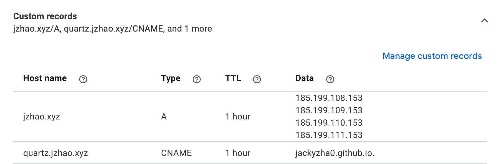

### Реєстрація
Цей крок застосовується тільки якщо ви використовуєте **кастомний домен**! Якщо ви використовуєте домен `<ВАШЕ-ІМ'Я>.github.io`, ви можете пропустити цей крок.

Щоб останній крок набув чинності, вам також потрібно створити запис CNAME у DNS-провайдера, у якого ви реєструєте свій домен (наприклад, NameCheap, Google Domains).

На GitHub є деяка [документація про це] (https://docs.github.com/en/pages/configuring-a-custom-domain-for-your-github-pages-site/managing-a-custom-domain-for-your-github-pages-site), але tldr; має

1. Перейдіть на сторінку налаштувань вашого форкованого репозиторію (`github.com/<ВАШ-GITHUB-USERNAME>/quartz`) і перейдіть на вкладку "Сторінки". У розділі "Власний домен" введіть свій власний домен, а потім натисніть **Зберегти**.
2. Перейдіть до свого DNS-провайдера і створіть запис CNAME, який вказує з вашого домену на `<ВАШ-GITHUB-ІМ'Я-користувача.github.io.` (так, з кінцевою крапкою).

	*Приклад конфігурації для Quartz*.
3. Зачекайте від 30 хвилин до години, поки зміни в мережі набудуть чинності.
4. Готово!