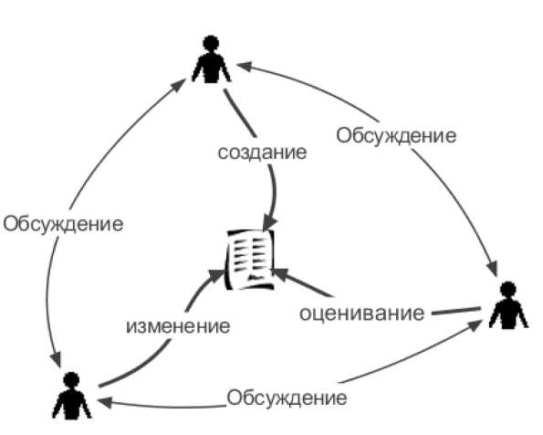
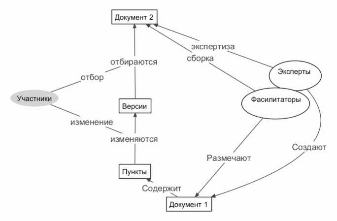
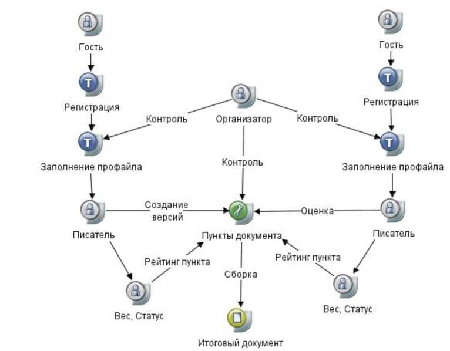
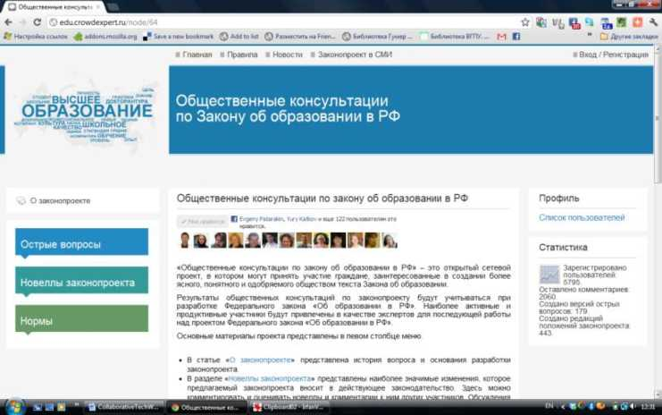
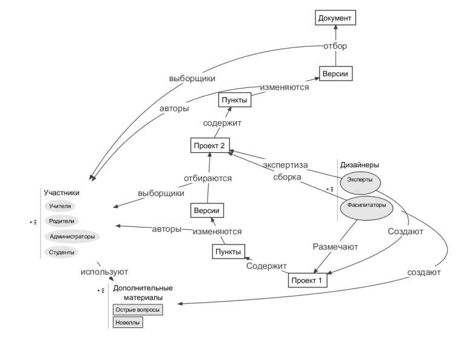

# Продвижение социальных инноваций через общественное конструирование документов

## Аннотация

В работе представлена методология создания и развития сетевых
объектноориентированных сообществ, внутри которых происходит
направленная селекция составных частей документа и отбор наиболее
продуктивных и конструктивных участников. Принципы, на которых
основывается деятельность:

Общественное конструирование документа, решающего сложные социальные
проблемы, является общественно-полезной образовательной практикой,
поддерживающей продвижение социальных инноваций.

Совместная деятельность по созданию или видоизменению объекта имеет
приоритетное значение по сравнению с обсуждением объекта.

Процесс селекции цифровых объектов (текстов) основывается на голосовании
участников.

### Ключевые слова

совместная сетевая деятельность, законотворчество, вики, менеджмент
идей, participation, collaboration, lawmaking, wiki, crowdsourcing

### Введение

В начале 21 века произошел переход от к культуры наблюдения и
обсуждения, которая допускала возможность чтения, просмотра, обсуждения
и голосования, к культуре непосредственного участия в создании и
изменении текстовых и медийных объектов. Во всех областях знаний - в
науке, законотворчестве, экономике, в образовании, в общественной
деятельности - везде мы видим участие граждан активных групп граждан уже
не в использовании и обсуждении текстов и медиаобъектов, а в их создании
и улучшении. В сфере информационных технологий граждане привлекаются не
только к использованию программного обеспечения, но и к тестированию
выпускаемых программных продуктов, к участию в разработке программных
систем и собственных приложений. С развитием рынка мобильных приложений
практика создания собственных программ становится повсеместной, и в ней
принимают участие не только профессионалы, но и студенты и школьники. В
сфере накопления и организации знаний сотрудники и клиенты организаций
привлекаются не только к использованию, но и к формированию цифровых
коллекций. Современные музеи и библиотеки находят пути для объединения с
общественными хранилищами текстов, фотографий и видеоматериалов подобных
Википедия, Flickr, YouTube и открывают возможность не только чтения и
наблюдения, но и повторного многократного использования. В сфере сбора и
распространения новостей наши современники все чаще выступают не в роли
читателей и зрителей, а в роли активных создателей новостного контента.
В сфере науки граждане благодаря открытости информационных ресурсов
граждане получают доступ к огромным массивам научной информации,
первичным данным, которые они могут самостоятельно изучать,
анализировать и использовать в своей деятельности, вступая в сообщество
обмена научными данными. В астрономии, геоинформатике, экологии,
социологии благодаря открытым данным и сервисам, которые поддерживают
работу с такими данными, возвращается эра любителей -людей, которые
принимают участие в научных исследованиях, а не только пользуются
результатами этих исследований. В сфере экономики привлечение граждан к
решению экономических проблем происходит настолько активно, что широкое
распространение получает термин - викиномика, означающий экономику,
основанную на участии граждан, на «мудрости толпы». В сфере
законодательной и законотворческой практике происходит активное
вовлечение граждан не только в обсуждение, но редактирование и улучшение
текстов законов. Государство рассматривается как платформа, которая
обеспечивает участие граждан в коллективной деятельности по улучшению
существующих решений, сервисов, служб и документов. В сфере
регионального управления и планирования граждане вовлекаются в
совместное решение городских проблем, предлагают и реализуют решения для
проблем, которые казались неуправляемыми, дикими и неразрешимыми.

В своей работе мы предлагаем новую стратегию совместной деятельности,
которая состоит в создании и развитии сетевых экосистем, внутри которых
происходит направленная селекция составных частей документа и отбор
наиболее продуктивных и конструктивных участников  совместной
 деятельности.  На

основании такой стратегии можно выстраивать различные формы работы со

структурированными текстами в сфере законотворчества, бизнеса и
общества. Для осуществления этой стратегии нами был  разработан
 методический  и

технологический инструментарий, основанный на объединении менеджмента
идей и

вики-технологии. Объединение методических и технологических подходов
коллективного создания гипертекста (wiki) и отбора наиболее
перспективных предложений путем голосования (vote) позволило создать
технологию коллективной работы с документами - WikiVote. Эта технология
уже активно используется в области электронного правительства и
открытого государства. Принципы, технология и методология wikivote могут
быть успешно применены в области электронной работы, общества,
исследования и обучения.


### Сфера общественного улучшения документов

Сфера организации массового участия граждан в совместном улучшении
документов задается несколькими векторами. Во-первых, это вектор сбора
коллективных знаний и использование потенциала «мудрости толпы». В
рамках этого направления ведется активная исследовательская
деятельность, разработка и анализ технологий, которые поддерживают
выявление и использование знаний граждан \[1; 2\]. В своем анализе
современной литературы мы обратили внимание на различные модели
организации краудсорсинговой деятельности. Линдерс \[3,4\] анализирует
растущее разнообразие государственных инициатив - вики-государство,
государство сотрудничества и другие. Казман и Чен \[5\] в своей статье
делают подробный разбор характеристик или компетенций, которыми должны
обладать краудсорсинговая система. В работе Сад-Салонен \[6\]
предпринята попытка рассмотреть всю систему электронного участия граждан
в жизни государства как цифровую экосистему. Этот подход позволяет
обратить внимание на разнообразие различных точек зрения участников, на
разнообразие используемых средств. В работе Дас и Вукович \[7\]
сообщество людей и компьютеров так же рассматривается в качестве единой
экологической системы. Авторы анализируют различные типологии
краудсорсинга. Особое внимание уделяется использованию теории игр и
различным стратегиям поведения участников. Грингард \[8\] анализирует
базовые концепции краудсорсинга и примеры реализации краудсорсинговых
проектов на базе таких платформ как карты Google, вики, Amazon's
Mechanical Turk, Ushahidi. Дик, Эден и Фишер \[9\] рассматривают
изменение модели поведения граждан в терминах метадизайна, главная
задача которого состоит в построении социо-технической среды, которая
поддерживала бы активное соучастие пользователей в развитии системы, а
не только в её использовании. Хаген и Робертсон \[10\] разбираются
основы дизайна среды соучастия- как организовать участие граждан в
развитии документа или хранилища знаний.

Во-вторых, это направление, в рамках которого возможно решение
слабоструктурированных, диких (wicked) проблем, значение которых в жизни
общества все более осознается \[11, 12\]. Для большинства социальных
проблем их решения во многом зависит от людей, которые принимают участие
в их разрешении. «Дикие» и «грязные» проблемы такого рода
противопоставляются «простым» и «ручным» проблемам, которые встречаются
в логике, физике, математике и других точных науках. «Дикие» проблемы
характерны для общественных и политических отношений. Такие проблемы не
поддаются точной диагностике, и их решение зависит от множества
участников. Проблемы города, проблемы здорового образа жизни, проблемы
образования, - все это примеры социальных, политических «диких» проблем.
Существует несколько способов решения «диких» проблем. Во-первых,
авторитарный способ, когда ответственность за решение проблемы
сосредотачивается в руках нескольких человек. Сокращение числа
заинтересованных сторон уменьшает сложность проблемы. Недостатком
является то, что вовлеченные в решение проблемы эксперты могут не
обладать видением всех необходимых перспектив. Второй способ работы с
«дикими» проблемами близок к первому и заключается в том, что для
решения проблемы создается несколько конкурирующих групп, которые
предлагают свои варианты решения. Сравниваются противоположные точки
зрения, и идет соревнование сторон, предлагающих различные решения.
Преимуществом такого подхода является то, что предлагаются и
сравниваются разные решения. Среди этих решений могут быть отобраны
лучшие. Недостатком этого способа решения «дикой» проблемы является
формирование конфронтационной среды, в которой между группами не
происходит обмен знаниями. Третий способ решения «дикой» проблемы связан
с организацией совместной деятельности, в которой принимали бы участие
представители всех групп, заинтересованных в решении проблемы.
Происходит вовлечение всех заинтересованных сторон в совместную
деятельность по поиску лучших решений. Участники не просто высказывают
свои мнения, но и активно участвуют в процессе формирования общего
решения. Как правило, общее решение формируется группой в виде
коллективного документа. Недостатком такого подхода является то, что
достижение общего понимания и решение «дикой» проблемы это - трудоемкий
процесс. Для поддержки этого процесса могут быть использованы специально
разрабатываемые информационные технологии. В рамках этого направления
разрабатываются технологии и методы, которые позволяют решать сложные
социальные проблемы путем сетевых общественных консультаций, совместной
сетевой деятельности, направленной на создание и улучшение документа
\[13-15\].

Рис. 1 Сфера применения технологии коллективного улучшения документов.

Документы, улучшаемые в ходе коллективного редактирования имеют
непосредственное значение для участников совместного редактирования и
рассматриваются участниками как правила или программы для дальнейшей
деятельности. В ходе общественного улучшения документов создается
платформа, на базе которой будут строиться дальнейшие отношения граждан.
Принятие нового закона означает, что у сообщества появляются новые
правила, которые позволяют этому сообществу действовать более
эффективно. Все граждане, дальнейшая деятельность которых подпадает под
действие данного закона, заинтересованы в его максимально точной, ясной
и логичной формулировке. Эта заинтересованность обеспечивает мотивацию
граждан к участию в изучении и улучшении документа. Выработка концепции
деятельности организации означает создание платформы, на базе которой
будет строиться дальнейшая деятельность членов этой организации и людей,
которые связаны с этой организацией. На основании выработанных правил
будет осуществляться деятельность общества. Активность общества
направлена на тестирование и доработку документов, которыми сами
граждане будут руководствоваться в своей дальнейшей деятельности.



### Принципы общественного улучшения документов

В рамках общественных и законотворческих проектов на платформе wikivote
мы формируем среду для совместной сетевой деятельности. Эта совместная
деятельность направлена на создание, улучшение и продвижения текстов
концепций, законов, коллективных книг или прогнозов.

Принципы, на которых основывается коллективная деятельность по улучшению
документов:

-   • Создание и видоизменение текста более ценно, чем обсуждение.

-   • Голоса участников неравноценны.

-   • Сам процесс общественного улучшения документа является формой
    продвижения в направлении более глубокого понимания документа
    обществом.

Совместная деятельность по созданию или видоизменению текста имеет
приоритетное значение по сравнению с обсуждением текста. Современные
технологии позволяют всем участникам совместной деятельности создавать
собственные версии текстового фрагмента. Эти версии могут быть оценены
другими участниками, и на основании этих оценок может быть произведена
селекция наиболее удачных и общественно-одобряемых версий. Мы
принципиально рассматриваем ценность сотрудничества выше ценности
обсуждения. Современное сотрудничество зачастую не нуждается в
обсуждении. Временные и организационные затраты на обсуждение могут быть
так велики, что у людей не остается сил и времени на сотрудничество.
Приоритет создания, изменения, оценивания над обсуждением представлен на
рисунке (рис. 2).

Рис. 2 Деятельность важнее обсуждения.

Процесс селекции цифровых объектов (текстов) основывается на голосовании
участников. Все голоса должны быть учтены, но влиятельность каждого
голоса зависит от вклада участника и того как этот вклад был оценен
сообществом. Чем больше вклад участника и оценка этого вклада
сообществом, тем значительнее влияние голоса участника внутри данного
сообщества.

Общественное конструирование документа, решающего сложные
слабоструктурированные     проблемы,     является
    общественно-полезной

образовательной практикой. Эта практика позволяет не только создать
документ более высокого качества, сформировать коллектив участников,
заинтересованных в дальнейшем воплощении документа в жизнь, но и
осуществить продвижение инновационного документа, обеспечить новый
уровень его понимания и восприятия в широких слоях общества.

Общее направление деятельности можно обозначить не только как
общественное улучшение текста документа, но и как форму общественной
оценки и поддержки инновационных процессов. Гражданам не просто
предъявляются общественные, технологические либо педагогические
инновации, но их вовлекают в совместную деятельность по продвижению
инноваций.

### Реализация технологии коллективной работы с документами

Устройство и дизайн системы коллективной работы над документом
направлены на коллективное конструирование статей и создание единого
финального документа. Учитывая общественную значимость создаваемых
текстов и ответственность, которая лежит на авторах конкретных поправок
и дополнений, мы стремимся избежать войны редакторских правок. Поэтому
при разработке методики совместной сетевой деятельности мы отходим от
традиционного вики-подхода, при котором каждый участник может
редактировать любой фрагмент текста и авторство правок фиксируется
только в истории страниц. В предлагаемой технологии wikivote каждому
участнику дана возможность создавать свои персональные варианты
небольших смысловых блоков - пунктов, из которых собирается статьи,
главы и весь заключительный текст документа. Использование таких
персонализированных блоков, которые могут обсуждаться и оцениваться
сообществом, а на основании этих оценок встраиваться в финальный вариант
доработанного проекта общественного документа, является ключевым
отличительным свойством предлагаемого подхода.

В соответствии с выбранным конструкционистским подходом, мы
рассматриваем проект документа как набор пунктов, из которых группа
конструирует новое общее для всех содержание. Общий принцип
представления текста - разделение документа на главы, статьи и разделы
статей. Такое разделение приближает контент к участникам сетевой
деятельности и снижает степень тревожности и неуверенности участников.
Обсуждаемый документ делается более доступным для изучения и прочтения.
Читатели могут познакомиться со всеми главами и статьями в одном месте,
не сталкиваясь с пугающим представлением в виде длинной сплошной ленты.
Документ становится более открытым, превращаясь из линейного текста в
сеть взаимосвязанных статей.

Единица документа, которая может изменяться, оцениваться и обсуждаться
-Пункт. Пункты образуют статьи. Статьи образуют главы. Главы образуют
документ -текст закона, концепции. Участники проекта обращаются с
текстом закона, как с конструктором, состоящим из пунктов - кубиков,
которые можно обсуждать, оценивать и видоизменять. Каждый представленный
пункт можно оценить по системе «За/Против», а также добавить собственный
комментарий. Если же участник считает, что пункт должен быть изменен и
улучшен, то он может создать собственную версию данного пункта, который
в свою очередь становится объектом для оценивания и комментирования
другими участниками сообщества, а также на основе этого может быть
дальше доработан его автором. В отличие от обычной википрактики, когда
для каждой страницы существуют возможности «комментировать» и «править»
для пунктов коллективно улучшаемого документа существуют возможности
«оценить», «комментировать» и «создать собственную версию». Для
фрагментов (пунктов) текста создаются версии и за эти версии голосуют
другие участники.

Общая схема деятельности по изменению документа представлена на рисунке
(рис. 3). Схема описывает следующую последовательность действий:

Эксперты (представители заказчика) создают базовую версию документа или
намечают основные разделы, по которым будет происходить сбор предложений
от участников.

Организаторы совместной сетевой деятельности (фасилитаторы) разбивают
документ на фрагменты - главы, статьи и пункты.

Участники проекта видоизменяют пункты документа, предлагая собственные
версии.

Участники проекта оценивают предложенные версии, голосуя «За/Против».

В заключительной части происходит автоматический отбор версий,
получивших наиболее высокую оценку.

Отобранные версии просматриваются и дорабатываются организаторами
совместной сетевой деятельности и экспертами. Создается документ №2,
который может быть передан заказчику, либо вернуться на доработку
сообществу.

Роль граждан как соавторов и первых тестеров общественно-значимого
документа еще на стадии его написания трудно переоценить. Граждане
оценивают, насколько предложенный текст будет рабочим, насколько он
применим к тем жизненным ситуациям, в которых они существуют - и тут
такие тестеры могут оказаться значительно полезнее официальных
экспертов, утративших связь с обществом. Граждане, выступающие в роли
тестеров и соавторов, могут предложить собственный вариант, который при
поддержке других участников может попадать в новый официальный релиз
документа.

Селекция составных частей документа внутри текстовой экосистемы
напоминает работу сообщества, тестирующего выпуск очередного релиза
компьютерной программы. Это сходство становится еще более заметным, если
деятельность сообщества не прекращается после выпуска первой версии
общественного документа, а продолжается в партнерстве с заказчиком. В
этом случае в системе появляется обновленный релиз документа, к которому
прилагается перечень изменений, которые были произведены: что нового
было сделано в этой версии текста, что было уточнено, какие пункты были
изменены, какие статьи изменили содержание, какие разделы были
совмещены, какие разделы были убраны.

Рис. 3 Общая схема работы над документом



### Организация совместной сетевой деятельности

Организация совместной сетевой деятельности по созданию и улучшению
документа предполагает следующую политику включения участников и
управления их деятельностью:

Любой желающий может прочитать все материалы проекта. Полноценное
участие в проекте (голосование, комментирование и создание собственных
версий) возможно только после регистрации и полного заполнении профайла.
Решение о делегировании прав участнику принималось организаторами
проекта на основании просмотра данных профайла. Необходимо отметить, что
это была достаточно формальная процедура. На практике, модератор включал
возможности статуса «писатель» всем участникам, заполнившим профайл. Тем
не менее, наличие такого простого «входного фильтра » оказывается
действенным механизмом, предотвращающим неконструктивные действия
участников. На площадках не было ни одного случая не только вандализма
(действий, направленных на разрушение и порчу общего содержания), но и
очень редко встречаются случаи троллинга (действий, направленных на
отвлечение, уход от конструктивного обсуждения).

Участник со статусом «писатель» может предложить собственную авторскую
версию каждого пункта статьи закона. Для каждого пункта возможно
создание единственной авторской версии для каждого участника. При этом
при создании новой версии система предлагает к редактированию исходный
текст пункта. Участник может редактировать текст пункта, вносить в него
правки, полностью менять содержание. После внесения изменений пункт
документа сохраняется и существует в системе под именем своего автора.
После сохранения и публикации авторского пункта никакие последующие
правки для автора недоступны. Авторская версия пункта представляется для
обсуждения и голосования. Участники проекта в статусе «писатель» могут
голосовать «за» или «против» любых версий, кроме своих собственных.

Важным мотивационным моментом (помимо собственно заинтересованности в
результатах проекта) является соревновательность авторов - в рамках
предлагаемой методики, работа участников внутри системы оценивается и
вклад каждого в комментирование, оценивание, создание собственных версий
приводит к росту рейтинга активности участника. При этом наибольший
вклад в рейтинг активности дает создание собственных версий. Значительно
меньше очков приносит оценивание версий. Самый малый прирост к рейтингу
активности дает комментирование версий. Как мы уже отмечали, это
принципиальное решение - не поддерживать дискуссии. Общая схема
взаимодействия авторов и организаторов представлена на рисунке (рис 4).
На схеме основной функцией организаторов является контроль деятельности
участников. Необходимо отметить, что контролирующие функции
организаторов постепенно отходят на второй план, и мы все большее
внимание уделяем информированию, поддержке и обучению участников
проекта.

Рис. 4 Взаимодействие участников и организаторов

Рейтинг активности участника зависит только от его активности. При этом
вес голоса участника зависит от того, как оценивают его редакции пунктов
документа другие участники. Вес автора, который написал одну-две
успешные редакции пунктов законодательного документа, будет значительно
выше автора, который создал множество неуспешных версий.

Рейтинг пункта зависит не только от количества участников, которые
проголосовали за или против этого пункта, но и от веса проголосовавших
участников.

В системе реализовано автоматическое создание улучшенной версии проекта
документа - по результатам голосований участников по пунктам статей
закона и авторским версиям этих пунктов система формирует новый
совокупный вариант, в который отбираются версии, получившие наиболее
высокую оценку сообщества.


### Примеры проектов, реализованных на основе технологии и методологии WikiVote

В 2011 - 2012 годы на основе технологии и методологии WikiVote были
реализованы несколько проектов:

-   • Общественное конструирование образа выпускника российской школы
    2020

-   • Общественные консультации по Закону об образовании в РФ



### Общественное конструирование образа выпускника российской школы 2020

Исследование проводилось в период с 30 апреля по 15 августа 2011 года. В
нем приняло участие 521 человек, создавшие 454 версии свойств
выпускника. Около 70% участников - работники образования (учителя,
методисты, преподаватели вузов). В работе также приняли участие
представители малого бизнеса, студенты, юристы, экономисты. Однако,
среди авторов, внесших существенный вклад в портрет выпускника 2020,
процентные отношения сгладились. Задача перед участниками ставилась в
формулировке: «Какими свойствами должен обладать выпускник российской
школы в 2020 году?». Все участники могли предлагать собственную
формулировку необходимого свойства, а также оценивать предложения
других.

Сайт проекта: <http://construct.crowdexpert.ru/>

Скриншот проекта представлен на рисунке (рис. 5).

Проект направлен на создание образа выпускника российской школы 2020
года. По результатам проекта мы сможем понять, что общество и
работодатели ждут от школьника ближайшего будущего. Выбранные с помощью
участников проекта умения и знания выпускника будут рассматриваться
правительством как наиболее значимые при определении направления
развития российского образования.

Работа над проектом завершилась 14 августа 2011 года. Новые предложения
свойств и изменения в оценке и описании свойств выпускника 2020 далее не
рассматриваются. Чтобы ознакомиться с материалами проекта путешествуйте
по категориям (меню слева) или воспользуйтесь страницей Поиск. Здесь
есть интерактивная карта с опубликованными свойствами. Обратите внимание
на действия наиболее конструктивных и продуктивных участников проекта.
Рейтинг участников строится на основании того, какие свойства они
предложили для обсуждения и как эти свойства были оценены другими
участниками.

/ Зарегистрировано і . пользователей: I 11 523. Создано

версий: 454 (опубликовано: 306, черновиков: 2). Написано комментариев:
2691

Презентация проекта

Рис. 5 Скриншот сайта общественного конструирования образа выпускника

Исходные материалы в форме основных категорий свойств выпускника и
нескольких примеров таких свойств размещались в систему модераторами
проекта. После размещения исходных материалов в систему были приглашены
участники, которые добавляли в категории собственные свойства
выпускника. Мы пытались организовать деятельность сообщества таким
образом, чтобы предложения о свойствах выпускника могли форедставителей непедагогических специальностей.

В качестве исходных материалов для создания свойств выпускника мы
использовали категории, в которые участники могли добавлять свои
предложения. При выборе исходных категорий мы опирались на опыт
российских и зарубежных проектов, в которых категории предлагались
экспертами. В связи с коротким сроком проекта мы не могли провести этап
формирования фолксономии - народной классификации свойств выпускника.
Как всегда бывает в рамках краудсорсинговых вики-проектов, по мере
развития содержания и появления новых идей менялись формы представления
и обсуждения информации. На площадке были опробованы различные метафоры
представления карты свойств выпускника. Это и строительные блоки,
подобные кирпичикам Лего и языку Scratch, и карты знаний FreeMind, и
диаграммы связей в оболочке визуального понимания (VUE). Активно
использовались сервисы Google и возможность встраивания интерактивных
гаджетов. Менялись не только технологии, но и правила совместной
деятельности. Заданные в начале проекта категории подошли далеко не всем
участникам. Участники начали активно использовать теги, и в
заключительной стадии проекта кроме Категорий уже можно было выделить
новые направления, к которым участники активно присоединяли новые
свойства выпускников.

При описании свойства выпускника участники использовали следующий
шаблон:

-   1\. В чем заключается свойство?

-   2\. Какие преимущества дает свойство? Если это свойство, эта функция
    или компетенция развита у выпускника, что это ему дает?

-   3\. Как проявляется свойство? Как мы можем оценить, что у выпускника
    оно присутствует?

-   4\. Как проявляется неразвитость свойства? К чему приводит
    неразвитость свойства?

-   5\. К чему может привести избыточное развитие свойства? Каковы
    негативные последствия развития свойства?

-   6\. Каких качеств требует свойство для своего развития?

-   7\. Какие свойства, качества, умения, компетентности связаны с
    данным свойством?

Описание всех предложенных сообществом навыков и умений выпускника можно
найти на сайте проекта. Для демонстрации методики отбора наиболее
значимых для сообщества свойств мы ограничимся представлением раздела
«Совместная деятельность». В категории совместной деятельности
сообщество наибольшее внимание уделило навыкам и умениям совместной
сетевой деятельности. Очевидно, такой интерес и внимание связано с
характером самого проекта сетевого создания портрета выпускника 2020.
Участники проекта сами активно взаимодействуют в сети и считают, что эти
навыки необходимы каждому выпускнику российской школы в 2020 году. По
мнению сообщества, выпускник российской школы в 2020 году должен быть
способен участвовать в общественных сетевых проектах, способен
использовать объекты, созданные в сети другими людьми, и готов делиться
результатами своего труда. В совместной сетевой деятельности ему
помогают чувство юмора, коммуникабельность и мобильность. Он не очень
понимает, что такое конфликтная конструктивность, и поэтому не
использует это умение. Интересно, что сообщество очень низко оценило
значение владения технологиями PR, посчитав, что для выстраивания
нормальных отношений они не нужны. Уровни поддержки свойств в категории
«Совместная деятельность» представлены на рисунке (рис. 6).

Одним из серьезнейших вызовов проекта была задача сборки финального
документа, в который вошли бы наиболее высоко оцененные сообществом
свойства выпускника российской школы в 2020 году. У нас были серьезные
сомнения в том, способно ли будет сетевое сообщество участников, в
которое входят представители разных профессий и возрастов договориться,
не перессориться и предложить свойства, относительно которых будет
достигнуто согласие. Среда, в которой реализовался проект, позволяет
получить автоматическую сборку лучших версий -свойств выпускника,
которые получили в разных категориях наиболее высокую оценку. Материалы
сборки отражают общую картину проекта и позволяют автоматически получить
общественно одобряемый портрет выпускника российской школы 2020.

Обобщенный образ выпускника 2020 позволяет нам судить не только о
свойствах выпускника 2020, но и о свойствах общества, которое создает
такой образ. Исходя из портрета выпускника 2020, мы можем выделять
черты, характерные для российского общества 2011.

Способность к сетевой самоорганизации (35)

Рис. 6 Оценка свойств в разделе \"Совместная деятельность\"

Выпускник 2020 знает, прежде всего, гуманитарные дисциплины - историю и
русский язык. Эти знания помогают ему лучше понимать и реализовывать
ценности, связанные с уважением и пониманием культуры народов России.
Общество полагает, что выпускнику 2020 придется жить и уживаться с
различными народами и приспосабливаться к различиям в их национальной
культуре.

Выпускник 2020 знает иностранный язык, прежде всего английский. Знание
иностранных языков, космополитизм и мобильность в глазах общества уже
сейчас важнее патриотизма. Выпускник должен уметь водить машину, знать
иностранные языки и быть готов жить и работать в культуре других
государств. Это черты общества, в котором выпускник должен быть готов
покинуть страну при первой же возможности.

Базовые знания точных наук (география, математика, химия, биология,
генетика физика) помогают выпускнику уверенно ориентироваться в мире
современных технологий (мобильные технологии, биотехнологии),
планировать собственную жизнь и семейный бюджет. Выпускник ориентирован
на конкретные прикладные дисциплины, фундаментальные науки выполняют
только вспомогательную роль. Базовых научных знаний выпускнику 2020 явно
не хватает для начала самостоятельной профессиональной деятельности, но
выпускник ориентирован на постоянное самообразование. Способность к
постоянному обучению - наиболее ценное свойство ученика 2020. Общество
уверено, что выпускник 2020 будет жить в условиях постоянного
информационного давления и ему понадобятся навыки анализа,
самостоятельность и устойчивость к медийным манипуляциям. Выпускнику
обязательно надо изучить основы точных наук. Даже не потому, что
придется использовать эти знания в трудовой деятельности, а, прежде
всего, затем, чтобы его не ввели в заблуждение рассказами про
нанотехнологии и генно-модифицированные продукты. Выпускнику 2020
необходимо формировать у себя критическое мышление, поскольку окружающий
мир по всем возможным каналам склонен вводить выпускника в заблуждение.

Выпускник 2020 хорошо ориентируется в мире информационных технологий и
постоянно использует информационные умения и дома и на работе. Эти
умения помогают выпускнику выстраивать отношения с другими людьми,
позволяют ему быть успешным в трудовой деятельности, которая требует
использования цифрового оборудования. Общество полагает, что и в быту и
в труде выпускнику будут необходимы информационные технологии. Эти
технологии являются источником повышенной опасности и выпускник должен
уметь организовать личную информационную безопасность. Информационные
технологии необходимы на уровне простейших бытовых навыков, и выпускник
2020 должен быть готов постоянно и повсеместно использовать программы -
общаясь с другими людьми, выстраивая свои отношения с обществом и
государством. Если выпускник не владеет ИКТ, то сфера его деятельности -
строительство и ремонт.

Среди личных качеств выпускника 2020 отличают самостоятельность и
ответственность. Выпускник 2020 готов к трудностям и неприятностям,
которые могут случаться с ним во всех сферах жизнедеятельности.
Выпускник может обеспечить собственную информационную безопасность дома
и на работе. Он готов оказать первую медицинскую помощь, выстоять в
условиях стрессового давления, выжить и выплыть в условиях техногенной
катастрофы. Образ такого выпускника характерен для общества, в котором
людям постоянно приходится преодолевать стресс и неуверенность.
Анализируя качества, которые общество приписывает выпускнику 2020, мы
можем прочитать следующее послание: «Выпускник 2020 должен быть
стрессоустойчив и хорошо физически подготовлен, поскольку ему придется
постоянно преодолевать стресс, самому искать выход из складывающихся
ситуаций. Выпускник будет жить в условиях постоянной физической
опасности и ему потребуются физическая готовность, волевые навыки и
знание технологий, прежде всего, для того чтобы просто выжить в условиях
нарастающей волны техногенных катастроф. Нужно научить выпускника
плавать и просто держаться на воде. Нужно научить выпускника
пользоваться мобильными технологиями, поскольку они могут помочь
выбраться из зоны техногенной катастрофы, но нельзя забывать и о навыках
поведения в дикой природе».

Общество обеспокоено сокращением ресурсов и надеется, что выпускник 2020
сможет более бережно относиться к запасам энергии, беречь ресурсы и
сохранять видовое разнообразие природы.

Плагиат и коррупция - понятия, которые, по мнению общества, обязательно
будут присутствовать в жизни выпускника 2020 и общество надеется, что
выпускник если не избежит этих явлений, то хотя бы будет относиться к
ним отвращением. Антиплагиативная и антикоррупционная установка, которую
общество посылает выпускнику 2020, говорит нам о степени обеспокоенности
общества этими явлениями.

Общество надеется, что выпускнику 2020 не придется постоянно проходить
тесты, говорить про лидерство и общественные отношения. Общество устало
от манипуляций этими словами и относится к ним с нескрываемым
раздражением. Возможно, что общество через такой портрет посылает
сообщение руководству страны - достали вы нас уже своими тестами ЕГЭ,
рассказами про лидерство, нанотехнологи и генно-модифицированными
продукты. Общество полагает, что сейчас не время для послушания и
скромной работы в команде, эти качества не принесут выпускнику 2020
жизненного успеха. Его гибкость и уравновешенность будут расценены как
проявление слабости. Общество надеется, что выпускник сумеет
позаботиться о своих родителях, потому что больше о них никто в этой
стране не позаботится. Свойства, которые общество приписывает выпускнику
2020, могут быть истолкованы как то, чего у нас нет в данный момент -
это наши беспокойство и наша неуверенность, которые проявляются в наших
надеждах и пожеланиях к выпускнику ближайшего будущего. Придет такой
прекрасный, самостоятельный и организованный выпускник, который будет
ненавидеть коррупцию и презирать плагиат, заботиться о родителях и
природе. С приходом такого выпускника наша жизнь наконец-то наладится.

В результате реализации проекта были получены:

-   1\. Документ, в котором описаны свойства выпускника российской школы
    2020

года. Поскольку большая часть авторов документа принадлежит к
учительскому сообществу, текущая версия документа отражает представление
учителей.

-   2\. Динамический конструктор свойств выпускника на площадке

<http://construct.crowdexpert.ru>. Эта площадка может быть использована
как инструмент долговременного наблюдения тенденций во взглядах на
будущее российского образования. Уже сейчас люди находят для этих
материалов неожиданное применение, анализируя в региональных
педагогических сообществах предложения, которые собраны на сайте
конструирования образа выпускника будущего.

-   3\. Сетевой коллектив авторов, которые начали сотрудничать на базе
    взаимного

комментирования и оценивания предложений. Эта деятельность может быть
продолжена и дополнена возможностью совместного редактирования наиболее
интересных версий.

Проект «Выпускник 2020» показал, как может быть устроена схема
совместной работы представителей разных профессий и социальных групп,
чтобы в результате возникало большее общественное понимание и рождались
не только совместные документы, но и способы совместной деятельности
представителей различных социальных групп. Форма совместность
деятельности, направленной на решение «дикой» проблемы - одно из главных
достижений проекта. Участники проекта не связанные профессиональными
рамками, выдвинули предложения, которые привлекли внимание сообщества и
позволили посмотреть на проблему с новой точки зрения.

[]{#main-9.xhtml}



### Общественные консультации по Закону об образовании в РФ

Сроки проведения: с сентября 2011 г. - проект продолжается в настоящее
время

Статистика проекта: В работе над проектом приняли участие более пяти
тысяч семисот граждан. Было оставлено более 2х тысяч комментариев,
выдвинуто более 170 идей по решению острых вопросов и создано более 400
редакций положений законопроекта.

Сайт проекта: <http://edu.crowdexpert.ru/>

Скриншот проекта представлен на рисунке (рис. 7).

Рис. 7 Скриншот проекта общественных консультаций по закону об
образовании в РФ

Особенности организации совместной сетевой деятельности в ходе проекта:

Проект реализуется Министерством образования и науки Российской
Федерации при поддержке компании WikiVote! и Фонда Общественное Мнение.
На сайте действует вспомогательный раздел «Новеллы законопроекта», где
представлены изменение, которое вновь изданный правовой акт вносит в
действующее законодательство. Во втором вспомогательном разделе «Острые
вопросы» представлены наиболее острые вопросы российского образования,
которые призван решить предлагаемый законопроект. Изначально в этом
разделе были предложены варианты острых вопросов, как их видят
представители министерства образования. У участников есть возможность
самим публиковать и оценивать предложения по тем вопросам, которые
представляются им наиболее острыми и требующими законодательного
решения. Деятельность в этом разделе важна для понимания того, каких
изменений общество ждет от нового законопроекта. Деятельность участников
поддерживается и организуется фасилитаторами проекта в режиме
посмтодерации. Кроме того, сетевую деятельность поддерживают
эксперты-юристы, которые следят за тем, чтобы в поле совместной
деятельности сообщества находились только предложения, которые связаны с
данным законом. Общая схема процесса общественного редактирования
представлена на рисунке (рис. 8).

Рис. 8 Общественные консультации по закону об образовании в РФ

Важно подчеркнуть, что коллективная деятельность по улучшению
законопроекта имеет долговременный характер и включает несколько этапов.
Эксперты и представители министерства разработали первый проект
законопроекта. Этот вариант был разбит на пункты и представлен сетевому
сообществу. Этот проект сообщество участников переработало и оценило.
Дизайнеры проекта на основании измененного варианта законопроекта
подготовило новую редакцию - версия 2. Процесс повторился. В результате
появилась версия 3. Данная схема взаимоотношений напоминает отношения
внутри сообщества пользователей и тестеров программного продукта.
Разработчики создают первую версию документа, и представляет её
участникам сообщества, в которое входят различные группы пользователей
этого документа. Участники тестируют отдельные разделы документа,
предлагают вариант изменений и улучшений. Варианты, получившие
наибольшую поддержку, рассматриваются разработчиком и включаются в новый
релиз документа (продукта), который вступает в силу (начинает
использоваться) до момента подготовки следующей версии продукта.
Разработчик публикует новый релиз продукта, и в пояснениях (новеллах) к
этому продукту указывает, какие именно изменения реализованы по
сравнению с предыдущей версией продукта (какие статьи изменили
содержание, какие разделы были совмещены, какие разделы были убраны.

При формировании сообщества мы исходили из того, что сообщество
обсуждения Закона об образовании может быть предельно широким и не
накладывали каких-либо ограничений на возраст, социальный статус,
занимаемую должность и т.д. При этом должна быть соблюдена определенная
репрезентативность представленных групп - в частности, чтобы не получить
«учительский» или «родительский» закон.

[]{#main-10.xhtml}



### Заключение

Представленный в работе подход использования коллективного знания в
совершенствовании структурированных документов является инновационным по
отношению к существующей практике, согласно которой разработкой законов
занимается очень узкая группа экспертов - юристов. Организация народной
экспертизы законопроектов связана с серьезными изменениями в
общественном сознании. Системы общественной экспертизы опираются на
готовность населения участвовать в таких проектах, доверие граждан к
новым сетевым правилам игры. Целью проектов коллективного творчества
является не только сбор общественного мнения, формирование документа,
стандарта или закона более высокого качества, но и формирование сетевых
коллективов, готовых решать новые общественные проблемы, повышение общей
сетевой культуры, рост доверия между различными слоями общества и, как
следствие, повышение эффективности сетевого общественного
взаимодействия. В настоящее время авторами ведутся работы по развитию
предложенной методологии не только в работе над законопроектами, но и
для работы над другими видами структурированных документов. Стратегия
коллективной деятельности и поддерживающие её методы и инструменты могут
служить основой для новых решений в области электронной работы,
связанных с созданием структурированных документов (техническая
документация, регламенты, стандарты).


### Благодарности

Разработка технологического решения для обеспечения проведения
общественных консультаций в Интернет поддержана Министерством
образования и науки РФ в рамках Федеральной целевой программы
\"Исследования и разработки\".



### Литература

-   1\. Howe J. Crowdsourcing: Why the Power of the Crowd Is Driving the
    Future of Business. Crown Publishing Group, 2009. 330 p.

-   2\. Lathrop D., Ruma L. Open Government: Collaboration,
    Transparency, and Participation in Practice. 1st ed. O'Reilly
    Media, 2010. 432 p.

-   3\. Linders D. We-Government: an anatomy of citizen coproduction in
    the information age // Proceedings of the 12th Annual International
    Digital Government Research Conference: Digital Government
    Innovation in Challenging Times. New York, NY, USA: ACM, 2011. P.
    167-176.

-   4\. Linders D., Wilson S.C. What is open government?: one year after
    the directive // Proceedings of the 12th Annual International
    Digital Government Research Conference: Digital Government
    Innovation in Challenging Times. New York, NY, USA: ACM, 2011. P.
    262-271.

-   5\. Kazman R., Chen H.-M. The metropolis model a new logic for
    development of crowdsourced systems // Commun. ACM. 2009. Vol. 52,
    № 7. P. 76-84.

-   6\. Saad-Sulonen J. eParticipation as an information ecology: a
    micro-scale examination of two cases in Helsinki // Proceedings of
    the 22nd Conference of the Computer-Human Interaction Special
    Interest Group of Australia on Computer-Human Interaction. New York,
    NY, USA: ACM, 2010. P. 384-387.

-   7\. Das R., Vukovic M. Emerging theories and models of human
    computation systems: a brief survey // Proceedings of the 2nd
    international workshop on Ubiquitous crowdsouring.

New York, NY, USA: ACM, 2011. P. 1-4.

-   8\. Greengard S. Following the crowd // Commun. ACM. 2011. Vol. 54,
    № 2. - P. 20-22.

-   9\. Dick H., Eden H., Fischer G. From consumers to owners: using
    meta-design environments to motivate changes in energy consumption
    // Proceedings of the Third international conference on End-user
    development. Berlin, Heidelberg: Springer-Verlag, 2011. P. 319-324.

-   10\. Hagen P., Robertson T. Social technologies: challenges and
    opportunities for participation // Proceedings of the 11th Biennial
    Participatory Design Conference. New York, NY, USA: ACM, 2010. P.
    31-40.

-   11\. Brown V.A., Harris J.A., Russell J.Y. Tackling wicked problems
    through the transdisciplinary imagination. Earthscan, 2010. 333 p.

-   12\. Fitzpatrick G. Locales Framework: Understanding and Designing
    for Wicked Problems. Norwell, MA, USA: Kluwer Academic Publishers,
    2003.

-   13\. Conklin E.J. Dialogue mapping: building shared understanding of
    wicked problems. Wiley, 2006. - 242 p.

-   14\. Munneke L. et al. Supporting interactive argumentation:
    Influence of representational tools on discussing a wicked problem
    // Comput. Hum. Behav. 2007. Vol. 23, № 3. - P. 1072-1088.

-   15\. Weber E.P., Khademian A.M. Wicked Problems, Knowledge
    Challenges, and Collaborative Capacity Builders in Network Settings
    // Public Administration Review. 2008. Vol. 68, № 2. -P. 334-349.
